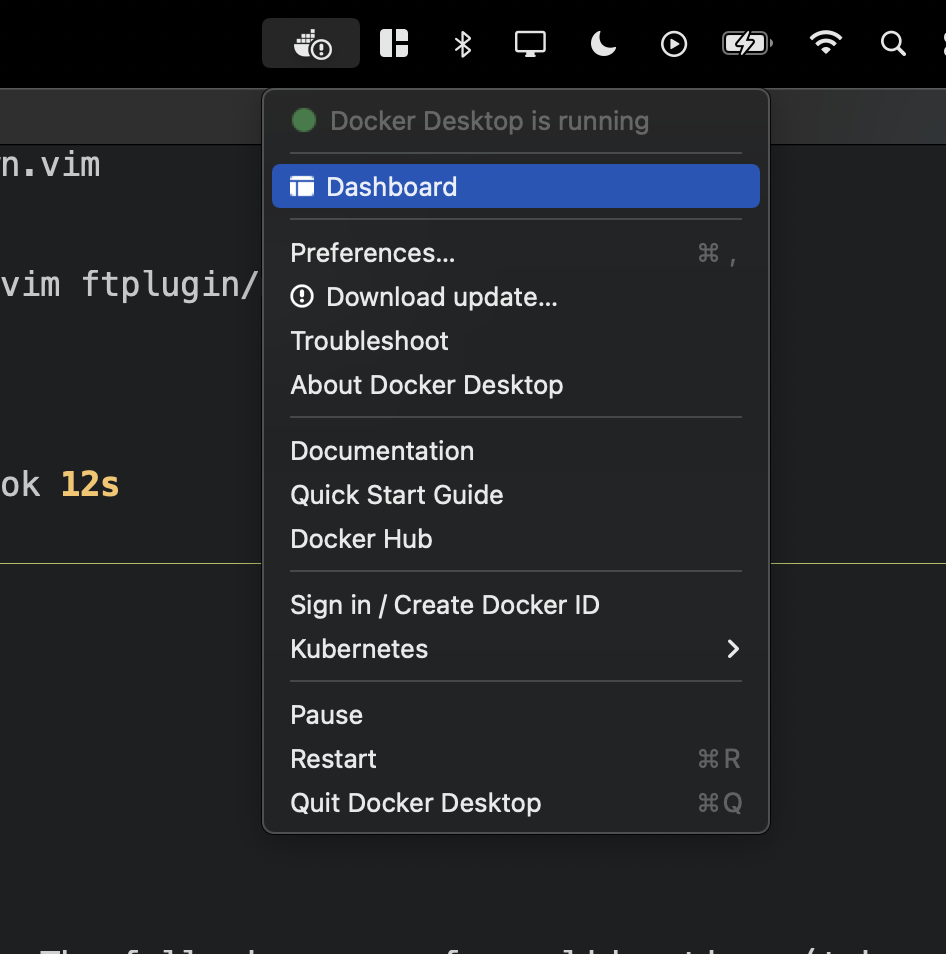
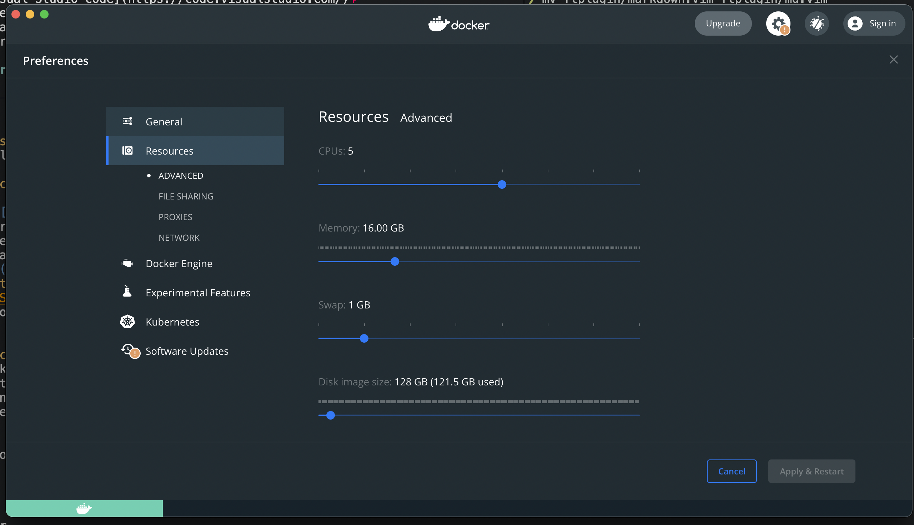

# hw00 - Installation
The goal of hw00 is to install and test the tool chain. For this class we will be utilizing [iic-osic-tools](https://github.com/iic-jku/iic-osic-tools) Docker container built and maintained by Dr. Pretl and the team at the Institute for Integrated Circuits, Johannes Kepler University Linz. Please follow the installation instructions for your appropriate operating system, test your installation and submit your test results.

---

**Contribution:** In the open-sourced spirit, all documents herein are maintained by everyone with a few primary maintainers. The quality and content is regulated by the efforts of the community. If you find mistakes or areas of improvement please open a pull request. 

---

# Instalation 

## OSX
1. **X-Code Select Tools**
    X-Code Select Tools are a set of standard UNIX tools that harken back to the original BSD fork that became OSX.
    Run the following in the Terminal app:
    ```
    xcode-select --install
    ```
2. Brew
    [Brew](https://brew.sh/) is the missing package manager for OSX. You will use this to install other tools. 
    Run the following in the Terminal app:
    ```
    /bin/bash -c "$(curl -fsSL https://raw.githubusercontent.com/Homebrew/install/HEAD/install.sh)"
    ```
    Please see [brew.sh](https://brew.sh/) for more information.
3. Text Editor
You will need a text editor (Microsoft Word is not a text editor) to acurately edit text files of all types with the correct encoding.. The following are a few solid options (take your pick and follow the appropriate installation instructions. 
    1. [NeoVim](https://neovim.io/) - Install using Brew
    2. [Atom](https://atom.io/)
    3. [Visual Studio Code](https://code.visualstudio.com/)
4. Github Account and SSH Keys
    1. Create a [Github](https://github.com/) account. 
    2. SSH keys allow you to access the Github repository without entering your password for every single `git push`. Create SSH keys by following the instructions [here](https://docs.github.com/en/authentication/connecting-to-github-with-ssh/generating-a-new-ssh-key-and-adding-it-to-the-ssh-agent) for your operating system.
5. Docker Desktop
  Docker Desktop is a nicely packaged installation method for the docker deamon and docker controller (both cli and gui). 
    1. Please install docker desktop from the [officla website](https://www.docker.com/products/docker-desktop/). **!!WARNING!!** There is a version for Apple SI and an version for Intel CPUs. Please install for your appropriate CPU. 
    2. Run Docker Desktop
    3. Open the dashboard
    
    4. Increase the resources made available to the containers. Try to alocate at minimum 2 CPU, 4GB of Memory and 1GB of SWAP. 
    
    5. Step thorugh the Docker Quick Start tutorial
6. X-Quartz
    [X11](https://en.wikipedia.org/wiki/X_Window_System) is a windowing system that though old, has some extremely useful features for sending windowing data over a network connection. X-Quartz is an OSX fork of X11. Please download and install X-Quartz from the [official website](https://www.xquartz.org/index.html). 
7. iic-osic-tools
    [iic-osic-tools](https://github.com/iic-jku/iic-osic-tools) is a Docker image built by Dr. Pretl and the team at the Institute for Integrated Circuits, Johannes Kepler University Linz that takes all of the open source IC design tools in addition to the pdk and packages them into one easy to use Docker Image. 
    1. Git Clone the repository to an easy to access location:
    ```
    git clone https://github.com/iic-jku/iic-osic-tools.git
    ```
    2. Start the docker container
    ```
    cd iic-osic-tools
    ./start_x.sh
    ```
    It will take a while the first time it is started (because it must pull the docker image), but eventually an X11 window will appear with a terminal.

## Windows
1. Text Editor
  You will need a text editor (Microsoft Word is not a text editor) to acurately edit text files of all types with the correct encoding.. The following are a few solid options (take your pick and follow the appropriate installation instructions. 
    1. [NeoVim](https://neovim.io/) - Install using Brew
    2. [Atom](https://atom.io/)
    3. [Visual Studio Code](https://code.visualstudio.com/)
2. WSL
    All osic design tools are designed for Linux. Though we will be running the tools themselves inside of Docker, it is slightly easier to install Docker if WSL is installed first.
    - Follow the instructions to install WSL2 [here from Microsoft](https://learn.microsoft.com/en-us/windows/wsl/install). Please make sure WSL2 is installed.
    - Note: depending on the version of Windows, it may be needed to install the WSL1 to WSL2 update manually with [these instructions](https://learn.microsoft.com/en-us/windows/wsl/install-manual#step-4---download-the-linux-kernel-update-package).
3. Docker
    Docker Desktop is a nicely packaged installation method for the docker deamon and docker controller (both cli and gui). 
    1. Please install docker desktop from the [officla website](https://www.docker.com/products/docker-desktop/). 
        1. Durring installation please ensure WSL2 option is selected. To run Linux Containers on Windows, Docker uses WSL. 
    2. Step through the docker quick start tutorial
4. Install the Scoop Package Manager
  Windows does not have a native package manager. 
    1. Follow the instructions from [scoop.sh](https://scoop.sh/) to install scoop.
5. Github Account and SSH Keys
    Git does not come by default on Windows and must be installed. 
    1. Use scoop to install Git. 
        1. Open Windows PowerShell
        2. Install with `scoop install git`
        3. Test the instalation with `git --version` and make sure there is no error.
    2. Create a [Github](https://github.com/) account. 
    3. SSH keys allow you to access the Github repository without entering your password for every single `git push`. Create SSH keys by following the instructions [here](https://docs.github.com/en/authentication/connecting-to-github-with-ssh/generating-a-new-ssh-key-and-adding-it-to-the-ssh-agent) for your operating system.
        1. The instructions refer to `git bash`. This was installed by scoop. 
6. Install and Start X11 Server 
    1. Install [VcXsrv](https://sourceforge.net/projects/vcxsrv/). This installs multiple small applications for utilizing X11 windowing.
    2. Start XLaunch application with the following options:
        1. Multi-Windows mode
        2. Display 0
        3. Start No-Client
        4. Tick all Extra settings: Clipboard, Primary selection, Native opengl, and Disable access control
7. iic-osic-tools
      [iic-osic-tools](https://github.com/iic-jku/iic-osic-tools) is a Docker image built by Dr. Pretl and the team at the Institute for Integrated Circuits, Johannes Kepler University Linz that takes all of the open source IC design tools in addition to the pdk and packages them into one easy to use Docker Image. 
      1. Open Windows PowerShell
      2. Git Clone the repository to an easy to access location:
      ```
      cd to-a-good-location
      git clone https://github.com/iic-jku/iic-osic-tools.git
      ```
      3. Run the docker container
      ```
      cd iic-osic-tools
      .\start_x.bat
      ```
      It will take a while the first time it is started (it must pull the docker iamge), but eventually an X11 window will appear with a terminal.


## Linux
We assume if you are running Linux you are skilled enough to figure out how to install all the needed tool chains for your own distribution. However, if you run into any issues please feel free to reachout with any issues.


## Additional Helpful, but Optional Tools
1. Alacritty
[Alacritty](https://github.com/alacritty/alacritty) is a GPU accelerated terminal written in Rust. It's much nicer than the default terminal 
2. Starship 
[Starship](https://starship.rs/) is a terminal prompt that gives extra information such as the git branch or python version.
3. TMUX
[TMUX](https://github.com/tmux/tmux/wiki) is a nice terimal multiplexer. 
4. fzf
[fzf](https://github.com/junegunn/fzf) is a powerful fuzzy finder. 


# Test and Submission
## Test your installation
1. Git SSH
Run the following to ensure that your ssh keys are set up properly
```
ssh -T git@github.com
```
2. OSIC Tools
    1. Start the `iic-osic-tools` docker container for your appropriate operating system.
    2. In the `iic-osic-tools` terminal, start `magic` and `xschem` with:
    ```
    magic -d XR &
    xschem -b &
    ```

## Submission
Please go to the Canvas page and do the following.
1. Enter the commandline output from testing your SSH keys into the provided text box.
2. Enter your github username into the provided text box.
3. Submit a screen shot of the Magic and Xschem tools


