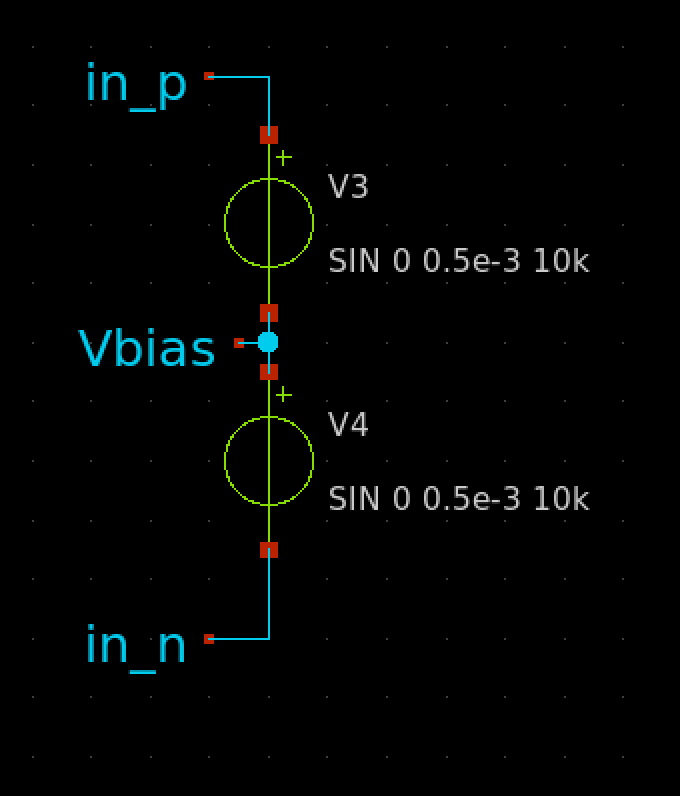

# hw02 - Differential Amplifier

Design and layout a differential to single ended amplifier.

### Schematic
Implement the following schematic. Obviously, there are no widths or lengths specified so that is your job. Additionally, some stability capacitors may be needed. Do not use any resistors.

### Specifications
| Metric | Value |
| :--- | :--- |
| Differential Gain | >30dB |
| Bandwidth (-3db point) | greater than 1GHz |
| Output DC Bias | 0.9VDC |
| Input DC Bias | 0.9VDC |
| Average power | less than 2.2mW |
| Input range | -1.8V to 1.8V |

### Hints
- Only use FETs with the explicit body connection. This will help you in LVS. 
- Start with just the differential stage first, then consider the two stages together. 
- In layout remove the guard rings; it will make layout easier.
- In layout, try to make it pretty; if it's pretty, it will probably work.
- Use the `gear` integration method for simulation.
- Use an `ac` analysis to find the bandwidth.
- The output of the differential stage should be 0.9V to ensure no loss in range.
- The output of the final amplifier stage should be 0.9V to ensure no loss in range.
- You will need to bias your input signals to turn on the transistors (a down side to the simplicity of the design). Please see the image below.

### Submission
Your submission will be a git repository and a design review slide deck (PDF).

#### Git Repository
Your git repository must address the following.
- Clone the starting repository
- Set to `private`.
- Add `mtseng15` and `aubreybeal` as colaborators to your repository.
- Please fill out your `README.md` with notes and details about your design and execution of simulations so we can also verify simulations.

### Design Review
Your design review must address the following:
- Include a link to your repository in your slide deck.
- Schematics and design process
- Simulations proving each of the design specifications in schematic simulation.
- Simulations proving each of the design specifications in layout extraction.
- Clean LVS output.
- Detailed Layout Pictures of Magic.
- Detailed Layout Pictures of GDS.
- Clean Magic `drc(full)` drc results.
- Clean Klayout drc results.

