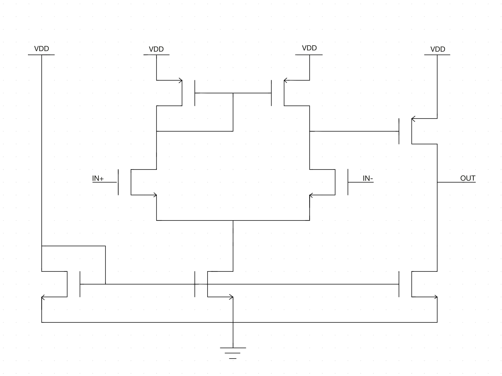

# hw02 - Differential Amplifier

Design and layout a differential to single ended amplifier.

### Schematic
Implement the following schematic. Obviously, there are no widths or lengths specified so that is your job. Additionally, some stability capacitors may be needed. Do not use any resistors.

### Specifications
| Metric | Value |
| :--- | :--- |
| Differential Gain | ? |
| Common Mode Gain | ? |
| Max Current through tail transistor | ? |
| Max THD | ? |
| Max IM3 | ? |
| Max Instainious Power | ? |
| Max Average Power | ? |

### Hints
- Only use FETs with the explicit body connection. This will help you in LVS.
- Use the `gear` integration method for simulation.
-

### Submission
Your submission will be a git repository and a design review slide deck (PDF).

#### Git Repository
Your git repository must address the following.
- Clone the starting repository
- Set to `private`.
- Add `mtseng15` and `aubreybeal` as colaborators to your repository.
- Please fill out your `README.md` with notes and details about your design and execution of simulations so we can also verify simulations.

### Design Review
Your design review must address the following:
- Include a link to your repository in your slide deck.
- Schematics and design process
- Simulations proving each of the design specifications in schematic simulation.
- Simulations proving each of the design specifications in layout extraction.
- Clean LVS output.
- Detailed Layout Pictures of Magic.
- Detailed Layout Pictures of GDS.
- Clean Magic `drc(full)` drc results.
- Clean Klayout drc results.

